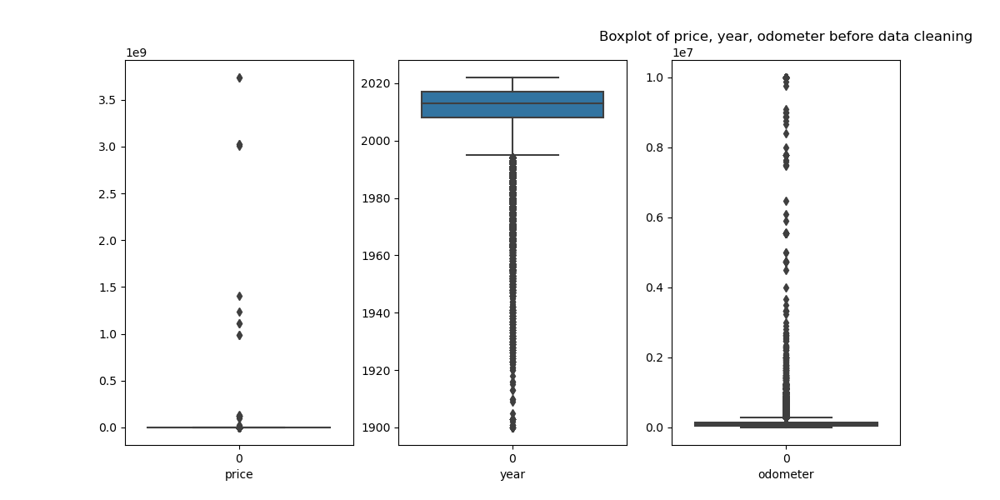
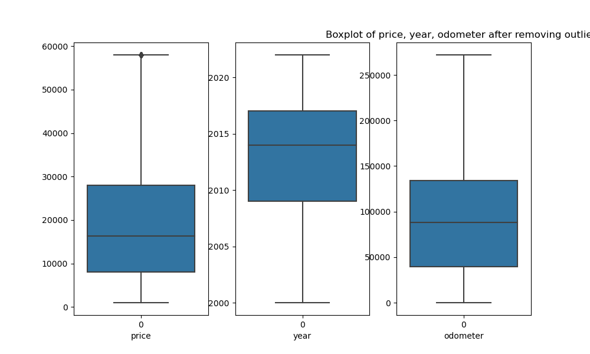
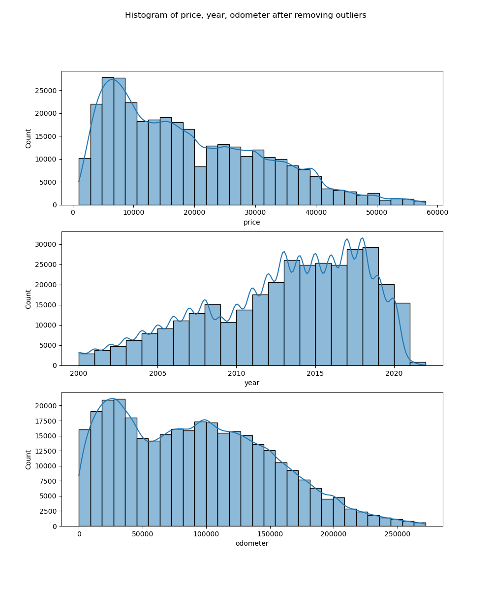
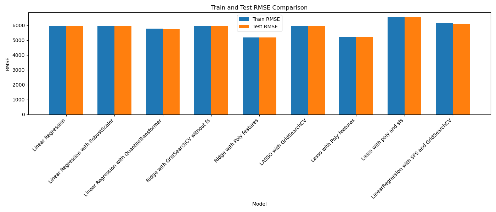
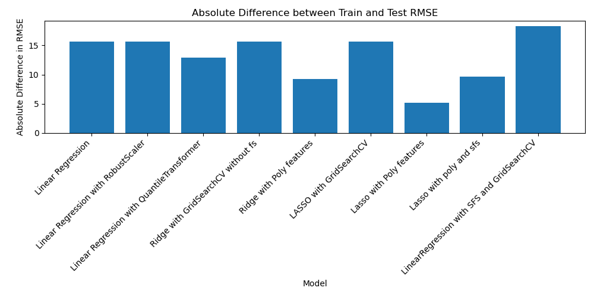
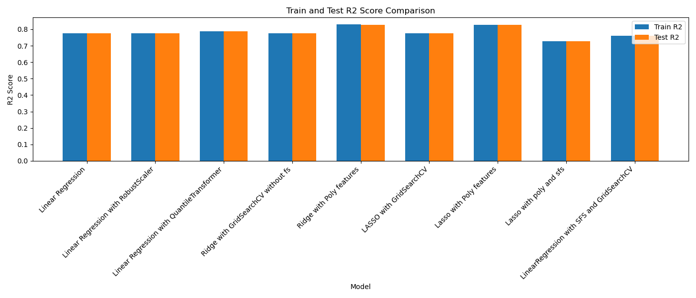
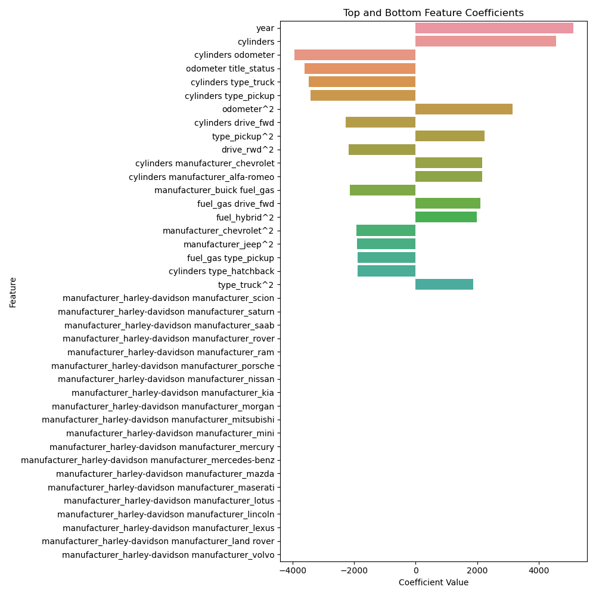

# What Drives the Price of a Car?

This project investigates a dataset of used cars to pinpoint factors affecting car prices and offers actionable insights for used car dealerships on consumer preferences.

[Data File](data/vehicles.csv)

## Prerequisites

### Tools and Environment

- **Jupyter Notebook**: Preferably via Anaconda-Navigator or any IDE supporting Jupyter Notebooks.
- **Python Version**: 3.11.5

### Essential Libraries

- matplotlib 3.7.2
- seaborn 0.12.2
- pandas 2.0.3
- plotly 5.9.0

## Exploratory Data Analysis

The analysis, complete with visualizations and detailed commentary, is thoroughly documented in the [Jupyter Notebook](./prompt_II.ipynb).

## Data Overview

The dataset initially contains 426,879 entries across 18 columns. Columns show varying levels of missing data:

| #   | Column        | Missing Data (%) | Dtype   |
|-----|---------------|------------------|---------|
| 0   | id            | 0.000%           | int64   |
| 1   | region        | 0.000%           | object  |
| 2   | price         | 0.000%           | int64   |
| 3   | year          | 0.282%           | float64 |
| 4   | manufacturer  | 4.134%           | object  |
| 5   | model         | 1.236%           | object  |
| 6   | condition     | 40.785%          | object  |
| 7   | cylinders     | 41.622%          | object  |
| 8   | fuel          | 0.706%           | object  |
| 9   | odometer      | 1.031%           | float64 |
| 10  | title_status  | 1.931%           | object  |
| 11  | transmission  | 0.599%           | object  |
| 12  | VIN           | 37.725%          | object  |
| 13  | drive         | 30.586%          | object  |
| 14  | size          | 71.767%          | object  |
| 15  | type          | 21.753%          | object  |
| 16  | paint_color   | 30.501%          | object  |
| 17  | state         | 0.000%           | object  |

## Data Cleaning

### Addressing Missing Values

- Removed `bus` types and `parts only` title statuses as they are irrelevant.
- Excluded truck models and manufacturers from the analysis.
- Assigned '8 cylinders' and 'automatic' transmission to electric cars for consistency.
- Imputed missing `manufacturer` values based on the associated `model`.
- Developed a mapping from `model` to populate missing attributes like `manufacturer`, `cylinders`, `fuel`, etc.

**Improvement in Data Completeness:**

- `year`:         0.153%
- `model`:        1.257%
- `condition`:   40.925%
- `odometer`:     0.888%
- `VIN`:         37.733%

### Handling Outliers

- Removed vehicles older than 20 years and applied the IQR method to adjust for outliers in the `price` and `odometer` data.

Before and after cleaning:

After dropping outliers and columns we don't need, we are with zero null values.

## Data Pre-Processing

- Removed non-predictive columns such as `region`, `paint_color`, and `state`.
- Applied one-hot encoding to categorical variables like `manufacturer`, `fuel`, `transmission`, `drive`, and `type`.
- Conducted label encoding on `title_status` based on predefined values.

I've ended with`69` features with 3 int, 2 float and 65 bool.Below is the histogram plot of int and float features.

## Models used for prediction

The performance of various regression models applied to predict car prices. The models vary by feature selection, scaling, and type of regression, providing insights into their effectiveness based on R2 and RMSE metrics.

## Models Evaluated

| # | Model                                         | Train RMSE | Test RMSE  | Train R2 | Test R2  |
|---|-----------------------------------------------|------------|------------|----------|----------|
| 0 | Linear Regression                             | 5955.836653| 5940.179106| 0.775216 | 0.774919 |
| 1 | Linear Regression with RobustScaler           | 5955.836653| 5940.179106| 0.775216 | 0.774919 |
| 2 | Linear Regression with QuantileTransformer    | 5783.899661| 5770.942404| 0.788007 | 0.787561 |
| 3 | Ridge with GridSearchCV without fs             | 5955.836729| 5940.175055| 0.775216 | 0.774919 |
| 4 | Ridge with Poly features                      | 5180.566963| 5189.848713| 0.829928 | 0.828190 |
| 5 | LASSO with GridSearchCV                       | 5955.837360| 5940.170236| 0.775216 | 0.774919 |
| 6 | Lasso with Poly features                      | 5210.651695| 5215.862428| 0.827947 | 0.826463 |
| 7 | Lasso with poly and sfs                       | 6545.251058| 6535.601860| 0.728524 | 0.727535 |
| 8 | LinearRegression with SFS and GridSearchCV    | 6144.348894| 6126.079257| 0.760762 | 0.760610 |

Note: I've also evalidated below. More details in jupyter notebook.

- Polynomial Regression: Overfitting
- Linear Regression with Polynomial Features using LASSO for Feature Selection: overfitting

### Key Observations

#### Linear Models

- **Linear Regression** showed closely matching training and testing R2 (0.7752 and 0.7749 respectively), with an RMSE difference of 15. However, negative price predictions were noted.
- **Linear Regression with RobustScaler** produced similar results to using a StandardScaler, indicating minimal impact from outliers.
- **Linear Regression with QuantileTransformer** slightly improved RMSE to a difference of 13, and R2 scores were 0.788 for training and 0.787 for testing.

#### Polynomial Regression

- Using degree 2 polynomial features resulted in significant overfitting, as indicated by a large discrepancy between training and test metrics, with very negative test R2 values.

#### Ridge Regression

- **Ridge Regression with GridSearchCV** was used to identify the best alpha (10), but it underperformed compared to simple Linear Regression.
- **Ridge Regression with Polynomial Features** yielded better results, reducing RMSE difference to 9 and achieving R2 scores of 0.829 (train) and 0.828 (test).

#### LASSO Regression

- **LASSO Regression with GridSearchCV** found the best alpha to be 0.1, showing similar performance to the Linear and Ridge regression models.
- **LASSO Regression with Polynomial Features** performed comparably to Ridge, with a test RMSE of 5215.862428 and test R2 of 0.826463.

#### Combined Feature Selection Techniques

- **Linear Regression with Sequential Feature Selector and GridSearchCV** settled on 20 features as optimal but required extensive computation time.
- **LASSO Regression with Polynomial Features and Sequential Feature Selector** demonstrated the necessity for more features to improve performance, achieving R2 values around 0.728.

## Evaluation

Upon examining the side-by-side RMSE plots, as well as the plots showing the absolute differences between Train and Test RMSE, and comparing the Train R2 and Test R2 scores, it becomes evident that **Lasso Regression with Polynomial Features** of degree 2 offers enhanced predictability.

**Optimal Model Among Linear, Polynomial, Ridge, and Lasso:**
Lasso Regression with Polynomial Features stands out as the most effective model.

Below are the corresponding plots for each model:

### Important Features

The plot above highlights the significant features that influence the model's predictions:

- **Year**: The newer the car, the more likely it retains a higher value.
- **Cylinders**: The number of cylinders influences performance characteristics, which in turn affect pricing.
- **Odometer**: Typically, higher mileage leads to lower prices due to wear and tear.
- **Drive Type (FWD/RWD)**: Front-wheel and rear-wheel drives are generally less expensive than all-wheel drives, which may indicate affordability.
- **Fuel Type (Gas and Hybrid)**: The absence of electric vehicles could be due to limited data availability or lack of tax incentives for used electric cars.

These features help in understanding the factors that most significantly impact the pricing of used cars as modeled by LASSO regression with polynomial features.

## Conclusion

The evaluation indicates that while more complex models like Polynomial Regression show promise during training, they tend to overfit the data significantly. Linear models, when equipped with appropriate regularization and feature scaling, and particularly when using polynomial transformations, offer more stable and consistent predictions. Feature selection is crucial in balancing model complexity and performance, especially in terms of preventing overfitting and ensuring generalizable predictions.

Negative price predictions observed across various models suggest the need for further model tuning or the exploration of alternative approaches to better address data-specific challenges. While polynomial features of degree 2 have shown some improvements, moving to degree 3 might increase the model's complexity and training duration without necessarily resolving the underlying issues.

We may have to use ensemble methods like Random Forest or other models as the relationship between our features and price is not linear. These methods can potentially offer better prediction accuracy and model robustness by aggregating predictions from multiple models or decision trees, thereby improving the generalization over a single predictor model.

## Additional Models

### Random Forest Model Summary

The Random Forest model implemented through a pipeline involving scaling with `RobustScaler` and regression with `RandomForestRegressor` demonstrates strong performance characteristics, as evidenced by the following metrics:

| Model         | Train RMSE  | Test RMSE   | Train R2 | Test R2 |
|---------------|-------------|-------------|----------|---------|
| Random Forest | 1268.492088 | 3305.760168 | 0.989803 | 0.930292 |

#### Observations

- **High R2 Scores**: The model achieves an excellent R2 score of 0.989 on the training data and 0.930 on the test data, indicating a high level of explanatory power regarding the variance in the target variable.
- **RMSE Discrepancy**: Although the Test RMSE is significantly higher than the Train RMSE, indicating some overfitting, it still outperforms other models like linear, polynomial, Ridge, and LASSO in terms of lower Test RMSE.

#### Ways to Improve the Random Forest Model

1. **Increase Number of Estimators**:
   - Increasing the number of trees in the forest (`n_estimators`) may provide more stable and accurate predictions by reducing the model's variance.

2. **Feature Engineering**:
   - Further refining input features, such as by adding interaction terms or more domain-specific features, could enhance model performance.

3. **Hyperparameter Tuning**:
   - Utilizing grid search or randomized search to optimize hyperparameters like `max_depth`, `min_samples_split`, and `min_samples_leaf` can help in controlling overfitting and improving the model's generalization.

4. **Cross-Validation**:
   - Implementing more robust cross-validation techniques, such as K-fold cross-validation, could provide a better understanding of the model's effectiveness across different subsets of the dataset.

5. **Advanced Ensemble Techniques**:
   - Exploring more sophisticated ensemble techniques like stacking or boosting may further improve prediction accuracy and model robustness.

#### Conclusion

The Random Forest model shows promising results with high R2 scores and competitive RMSE values when compared to simpler regression models. However, some potential overfitting necessitates further adjustments and optimizations. Implementing the aforementioned improvements could potentially elevate the model's performance, making it more robust and reliable for predictive tasks.
